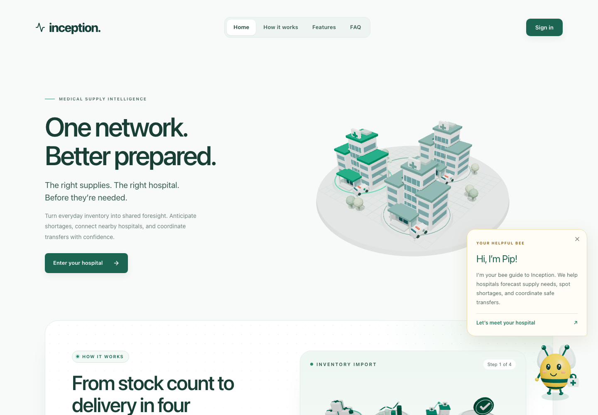
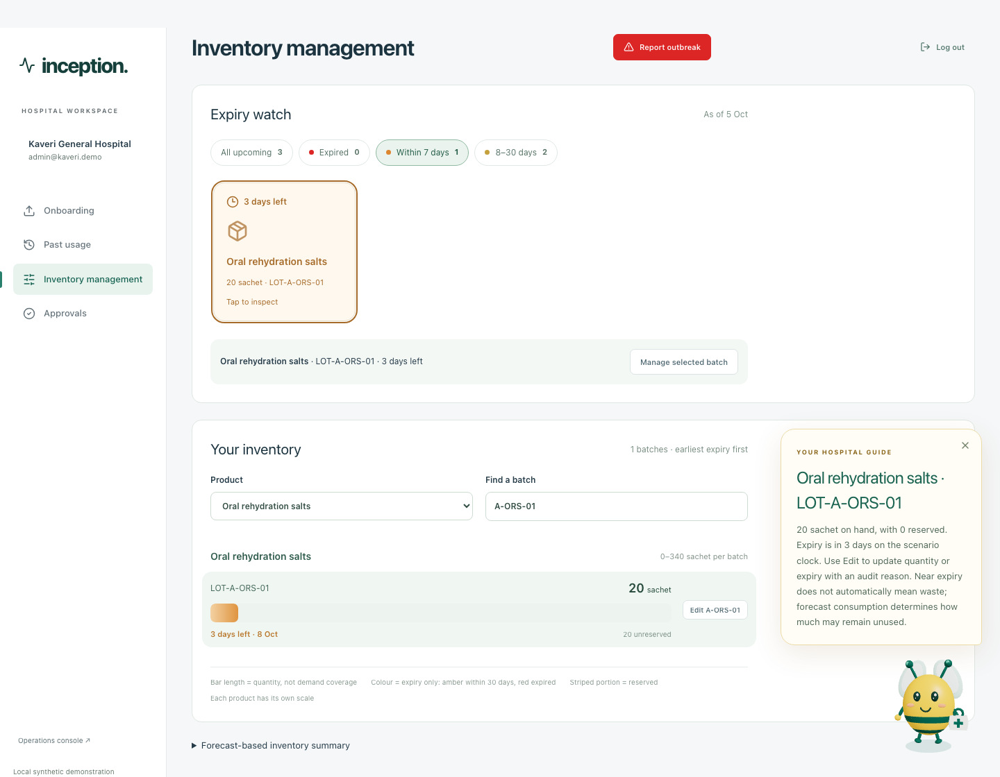
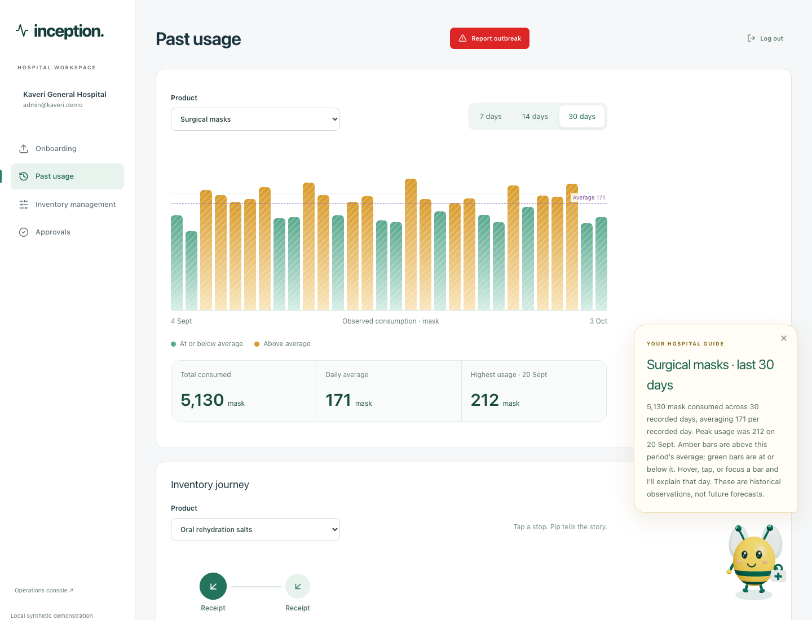
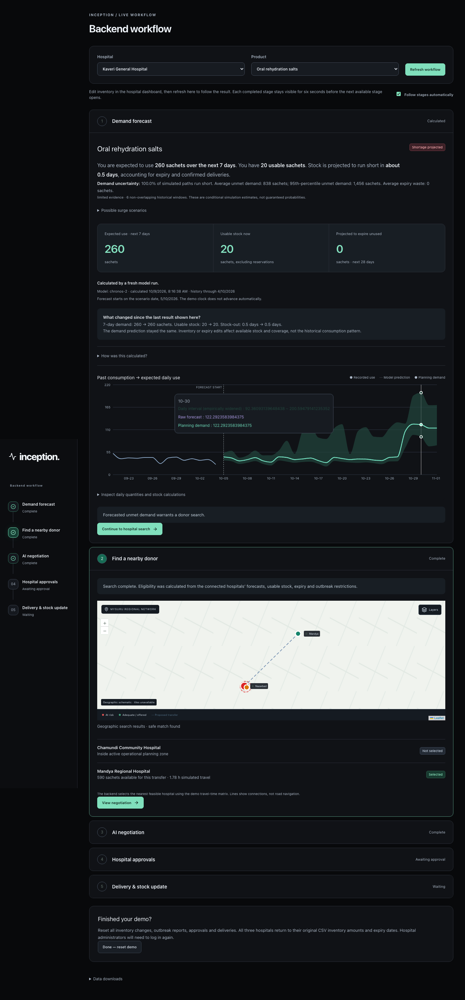
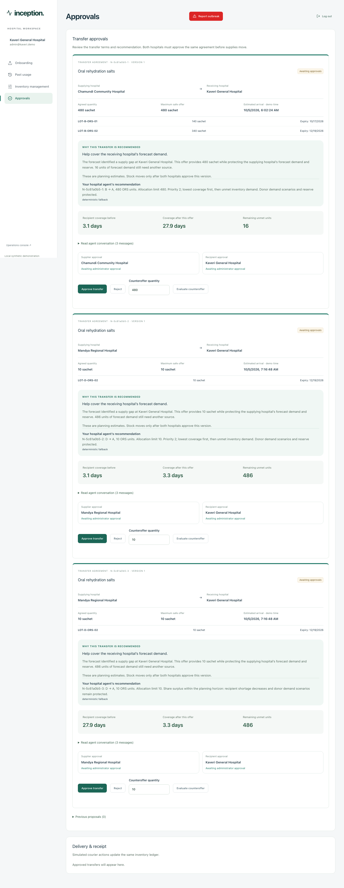
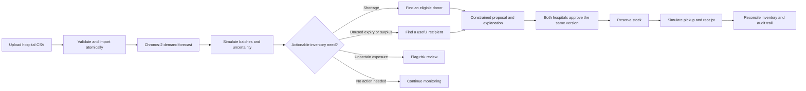
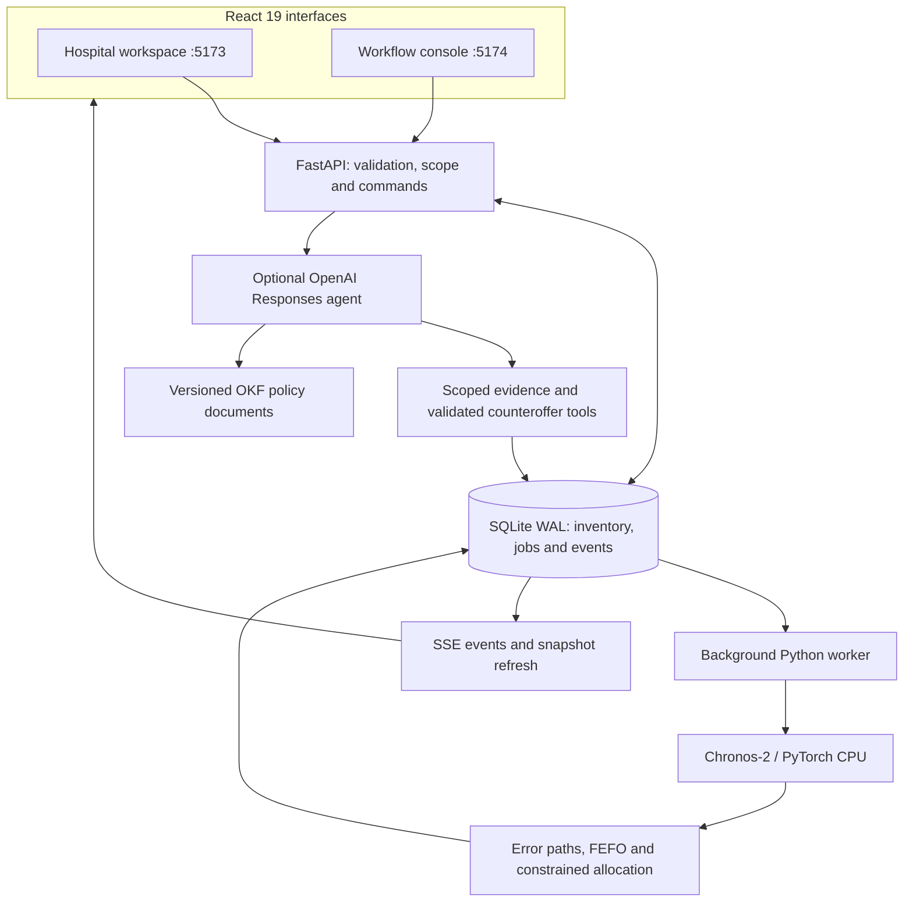

<div align="center">

# inception.

### Know before the shortage. Share before the waste.

**Inventory intelligence for hospital networks — from consumption history to an auditable transfer.**


[Quick start](#quick-start) · [Product tour](#product-tour) · [How it works](#how-it-works) · [Forecasting](#forecasting-that-explains-its-limits) · [Validation](#validation) · [Documentation](#documentation)

</div>



A hospital can have enough stock today and still run short next week. Another can have the same medicine sitting unused until expiry. **Inception connects those two decisions:** forecast consumption, simulate each batch, find a useful transfer, and require both hospitals to approve it.

Built for the Singularity medical-supply track, this working local prototype uses **Amazon Chronos-2**, inventory-aware simulation, and scoped hospital agents. It needs consumption and inventory records; **patient records are not forecast inputs**.

| Demo network | Forecast horizon | Human control | Traceability |
| :--- | :--- | :--- | :--- |
| 3 fictional hospitals · 3 supplies | 28 days per hospital and supply | 2 approvals on the same terms | Batch movements, events and reconciliation |

## Product tour

**One ledger. Two perspectives.** Hospital staff work with their own stock and approvals. The workflow console exposes the calculations, partner search and transfer lifecycle.

### Hospital workspace · inventory with context

Expiry filters, searchable batches, reservations and contextual guidance turn a stock list into an actionable view. Near expiry does not automatically mean surplus: expected consumption determines what may go unused.



<details>
<summary><strong>Explore three more views: consumption, forecasting and agreements</strong></summary>

**Understand consumption.** Inspect historical usage by supply before interpreting the forecast.



**Follow the decision.** The dark workflow console shows demand, uncertainty, candidate hospitals and the reason a partner is eligible or excluded.



**Approve explicit terms.** A transfer agreement names the supplying and receiving hospitals, quantities, batches, expiry dates and the explanation behind the proposal.



</details>

*Actual application captures using synthetic demo data, recorded 9 October 2026. Screenshots show different test states; quantities are examples, not fixed recommendations. Agent fallback and unavailable map tiles remain labelled. [Screenshot provenance](docs/images/README.md).*

## How it works



1. **Import once.** One CSV carries hospital identity, supply definitions, batches and daily consumption. Invalid imports roll back together.
2. **Forecast consumption.** Chronos-2 predicts demand; reported requirements and observed surges can raise the planning path.
3. **Evaluate consequences.** First-expiry-first simulation estimates shortage timing and waste under multiple demand paths.
4. **Find a useful match.** Whole-pack offers must satisfy donor protection, recipient consumption, shelf life, storage and unit constraints.
5. **Keep people in control.** Both administrators approve the same proposal version. Pickup and receipt update the shared ledger through explicit simulated actions.

**Fresh imports establish the baseline.** In the three-hospital demo, inventory edits or demand reports start the actionable workflow. An empty approval inbox after upload is intentional.

## Forecasting that explains its limits

The operational model is **[Amazon Chronos-2](https://huggingface.co/amazon/chronos-2)**, running on CPU through PyTorch. The CSV supplies inference context; the application does not fine-tune the neural network.

| Method | What it does here |
| :--- | :--- |
| **180-day context → 28-day horizon** | Produces daily P10, P50 and P90 estimates for each hospital–supply series. |
| **Consumption + weekday** | Uses inventory history and known calendar information. Legacy clinical columns are optional and excluded from model inputs. |
| **Causal imputation** | Estimates missing or stockout-constrained observations from earlier history and flags them. Missing days are not silently treated as zero demand. |
| **Rolling-origin backtesting** | Predicts historical future blocks from earlier inputs; reports MAE, WAPE, quantile loss, interval coverage and width. Two simple baselines provide comparisons. |
| **Empirical interval widening** | Uses completed historical error paths to widen daily uncertainty bounds when past errors warrant it. |
| **Median/MAD + CUSUM** | Flags unusual consumption and persistent underprediction. Persistence and corroboration rules reduce isolated-spike alerts. |
| **Whole-path Monte Carlo** | Resamples historical 28-day error sequences 1,000 times with a reproducible seed. Duplicate selections are combined into weighted paths. |
| **Surge scenarios** | Applies reported requirements and observed-surge planning floors; separately evaluates 1.5× and 2× demand stress paths. |

**1,000 draws do not mean 1,000 model calls.** Chronos produces the forecast; resampling explores historical ways that forecast might be wrong. The demo commonly has 21 overlapping error paths, spanning roughly six non-overlapping windows. More draws do not create more historical evidence.

The resulting shortage frequencies are **conditional simulation estimates**. They are not clinically validated probabilities. Summing daily P90 values does not yield a calibrated P90 for total demand, and inventory history alone cannot reliably predict an unseen disease outbreak.

Chronos remains selected in normal operation. If loading or inference fails, the analysis job fails visibly. `INCEPTION_FORECAST=baseline` is an explicit offline development mode; baselines never silently replace Chronos.

## Inventory rules that make the forecast useful

- **Protect the donor:** retain a fixed 28-day higher-demand planning requirement plus a normal-day unit buffer. Supplier delivery delay does not determine this horizon.
- **Check likelihood and severity:** additional provisional limits use at most 5% simulated shortage frequency and half a pack of expected unmet demand. These are engineering policy settings, not research-proven optimal thresholds.
- **Respect every batch:** simulate expiry, reservations, quarantine, confirmed arrivals and incoming transfers using fractional-day FEFO consumption.
- **Make transfers useful:** require compatible units/storage, whole packs and recipient consumption without increasing expected expiry waste.
- **Handle expiry carefully:** a hospital can face expiry now and shortage later. The expiry-rescue exception releases stock only when every evaluated path would otherwise waste those units and donor unmet demand does not increase.
- **Recheck at approval:** changed terms clear earlier approvals; current stock and safety constraints are validated again before reservation.
- **Preserve stock accounting:** repeated commands cannot double-apply a movement; concurrent approvals cannot double-reserve a batch.

The authoritative thresholds live in [`config.py`](backend/inception/config.py), with enforcement in [`engine.py`](backend/inception/engine.py) and [`transactions.py`](backend/inception/transactions.py).

## Architecture



Forecast computation runs outside database write transactions. The worker commits only if its inventory revision and demo generation are still current, so an old job cannot overwrite a reset or newer edit. SQLite uses short transactions and a single forecast worker.

The agent explains evidence and can propose bounded counteroffers through server-validated tools. **It cannot approve a transfer or move stock.** Numerical policy enforcement stays in Python.

| Layer | Technology | Why it is here |
| :--- | :--- | :--- |
| Interfaces | React 19, TypeScript, Vite | Interactive hospital views and a separate workflow console sharing typed data. |
| Data and visuals | TanStack Query, Recharts, Leaflet | Snapshot refresh, forecast charts and geographic partner context. |
| Product scenes | Three.js, React Three Fiber | Interactive hospital scenes and Pip’s contextual guidance. |
| API | FastAPI, Pydantic | Validated commands, scoped responses and inspectable OpenAPI documentation. |
| Forecasting | Chronos-2, PyTorch, pandas, NumPy | CPU inference, time-series preparation and empirical uncertainty calculations. |
| Persistence | SQLite WAL, SQLAlchemy, Alembic | Transactional inventory records, durable jobs and schema management. |
| Agent explanations | OpenAI Responses API, OKF documents | Optional tool-based explanations backed by current hospital evidence and policy. |
| Verification | pytest, Playwright, TypeScript build | Domain invariants, browser journeys and compile-time checks. |

## Quick start

**Prerequisites:** Python 3.12 via `uv`, Node.js 20+, npm and `make`. Allow approximately 2 GB for dependencies/model storage; the first model download needs internet access.

```bash
git clone https://github.com/Preethesh16/Inception.git
cd Inception
make setup
make setup-forecast
cp .env.example .env
make dev
```

Skip the clone when already inside the repository. Keep an existing `.env` rather than overwriting it.

| Service | Local address |
| :--- | :--- |
| Hospital workspace | http://localhost:5173 |
| Workflow console | http://localhost:5174 |
| API documentation | Printed by the launcher: `/docs` on port 8000 or the next free port |

`make dev` launches the API, **one CPU worker** and both interfaces. `Ctrl+C` stops them; restarting preserves the ledger.

<details>
<summary><strong>Configuration, dependency reproduction and external services</strong></summary>

The checked-in [`.env.example`](.env.example) documents configuration. Keep secrets in `.env`, which is ignored by Git.

| Variable | Purpose |
| :--- | :--- |
| `INCEPTION_FORECAST=chronos` | Default operational forecasting mode. |
| `CHRONOS_MODEL` / `CHRONOS_REVISION` | Pinned model and revision; no paid model API key is required. |
| `OPENAI_API_KEY` / `OPENAI_MODEL` | Optional live agent explanations and constrained counteroffer responses. |
| `VITE_CARTO_KEY` | Optional CARTO map tiles. |
| `INCEPTION_DATA_DIR` | Alternate data directory, useful for isolated tests. |
| `INCEPTION_API_PORT` | Preferred API port; the launcher chooses the next available port. |

Without an OpenAI key, explanations are labelled **deterministic fallback**. Without CARTO, maps use OpenStreetMap tiles; unavailable tiles produce a labelled geographic schematic. Browser tests deliberately block public tiles. See the [OpenStreetMap tile policy](https://operations.osmfoundation.org/policies/tiles/).

For the committed Python dependency snapshot, after creating the virtual environment:

```bash
uv pip sync requirements.lock --extra-index-url https://download.pytorch.org/whl/cpu --index-strategy unsafe-best-match
```

The indexes are PyPI and the official PyTorch CPU wheel repository. Frontend dependencies are pinned in `frontend/package-lock.json`.

</details>

## Try the complete demo

All accounts below use **`Demo@2026`**. They represent fictional hospitals and local demo roles.

| Hospital | Email | Starting role |
| :--- | :--- | :--- |
| A · Kaveri General | `admin@kaveri.demo` | Upload the [A-hospital CSV](demo-data/three-hospital/A-hospital.csv). |
| B · Chamundi Community | `admin@chamundi.demo` | Preloaded nearby partner. |
| D · Mandya Regional | `admin@mandya.demo` | Preloaded partner outside the nearby planning zone. |

1. **Onboard A:** upload the supplied CSV and wait for analysis. It contains 237 days of history for ORS, saline and masks.
2. **Create a shortage:** set `A-ORS-01` and `A-ORS-02` to **10 units each** in Inventory management. Save and reassess.
3. **Inspect the workflow:** select Kaveri and ORS in the console, then click **Refresh workflow**. Stock coverage changes even when historical demand is unchanged.
4. **Exercise surge planning:** report **140 additional ORS units over seven days** at A, then at nearby B. Inspect the changed planning zone and donor eligibility; D can become the supplying hospital when its checks pass.
5. **Review and approve:** test a counteroffer above the displayed cap, then approve valid terms from both participating hospitals.
6. **Finish the transfer:** simulate delivery and verify exact stock changes and **Ledger balanced**.

The scenario begins on **5 October 2026**. Interpret expiry dates against that scenario clock, not the computer’s date. Offer quantities are computed, not hard-coded.

**Reset deliberately:** **Done — reset demo** restores all three hospitals and clears the workflow. Logging out of A clears its import and the demo reports; B/D stock is retained. These are demonstration controls. [Full walkthrough and reset semantics →](docs/demo-walkthrough.md)

### CSV contract

The single-file importer dispatches rows by `record_type`. Required inventory history is sufficient; no patient details are needed.

| Record type | Contents |
| :--- | :--- |
| `profile` | Hospital identity and location. |
| `supply` | Supply identifier, unit, pack size and storage. |
| `batch` | Lot, on-hand quantity and expiry. |
| `consumption` | Dated consumption with completeness/censoring flags. |
| `replenishment` | Optional confirmed/scheduled stock arrivals. |

Use the supplied [three-hospital datasets](demo-data/three-hospital/) and [dataset documentation](docs/dataset.md) as the import reference. The upload interface accepts **CSV**; native `.xlsx` import is not claimed.

## Validation

**Recorded local verification: 9 October 2026, implementation commit `17ad6f4`.** These are dated results, not a hosted CI status.

| Check | Recorded result |
| :--- | :--- |
| Backend suite | **80 passed** — forecasting, expiry, access scope, import rollback, approval versioning and inventory conservation. |
| Browser coverage | **18 distinct checks passed across reruns** — upload, dashboards, workflow, agreements, login/logout and responsive layouts. |
| Production frontend build | Passed TypeScript and Vite compilation. |
| Live assistant | OpenAI response with evidence references; no fallback in the explicit integration check. |

The final focused agreement/transfer checks used **real Chronos-2 with deterministic automatic briefings** to isolate UI behaviour from external-service latency. A live assistant call was checked separately. The integration run found and fixed a dashboard risk-field mismatch. [Detailed validation record →](docs/validation.md)

```bash
make test              # backend tests; no paid API credentials
make build             # TypeScript + production frontend build
make types             # regenerate the OpenAPI contract and request types
make evaluate          # separate synthetic evaluation, not a clinical benchmark

# With make dev running, in another terminal:
cd frontend
npx playwright install chromium
npm run test:e2e
```

**Browser tests reset and mutate demo data.** Point `E2E_API_TARGET` at a separately launched API and worker using their own `INCEPTION_DATA_DIR` to preserve an active demonstration. See [validation instructions](docs/validation.md#reproduce-the-checks).

## Repository map

```text
backend/inception/
  api.py              # requests, scope, imports and event streaming
  forecast.py         # Chronos inference, historical checks and cache
  uncertainty.py      # residual paths, CUSUM and weighted risk metrics
  engine.py           # FEFO simulation, protection and allocation
  redistribution.py   # shortage, surplus, expiry and review decisions
  transactions.py     # versioned approvals, reservations and movements
  worker.py           # durable analysis jobs and stale-result protection
frontend/src/
  TrioApp.tsx         # hospital workspace and workflow console
  components/         # forecasts, inventory, agreements, maps and scenes
  lib/                # API client and shared types
backend/tests/        # domain and API regression coverage
frontend/tests/       # browser acceptance journeys
knowledge/            # versioned OKF policies and playbooks
demo-data/            # synthetic CSV inputs
docs/                 # architecture, datasets, validation and walkthrough
```

## Scope and next steps

This is a **local, synthetic hospital-inventory prototype**. It demonstrates forecasting and software behaviour; it does not establish clinical effectiveness or accuracy on real hospital demand. Operational zones are reported/anomaly-based planning overlays, and courier actions are simulated.

Production adoption would require authenticated tenant isolation, real inventory integrations, prospective forecasting validation, monitored policy calibration and operational deployment work. The allocator is a constrained heuristic; global network optimality is not claimed.

## Documentation

- [Presenter walkthrough](docs/demo-walkthrough.md) — exact actions and demo reset behaviour.
- [Architecture and invariants](docs/architecture.md) — transactions, concurrency and design trade-offs.
- [Datasets and import format](docs/dataset.md) — records, history and synthetic opening balances.
- [Agents and knowledge](docs/agent-knowledge.md) — scoped tools, provenance and live checks.
- [Validation record](docs/validation.md) — what was tested and what the evidence supports.
- [Historical synthetic evaluation](docs/evaluation-reference.json) — archived measurements, not current-model guarantees.

### Working on Inception

For a useful issue, include the scenario date, hospital/supply, exact edit or CSV, expected result and observed result. Exclude credentials and real patient information. Changes to stock or forecasting logic should preserve the [operational invariants](docs/architecture.md#critical-invariants) and include a focused regression test. UI changes should pass the build and relevant browser journey.
