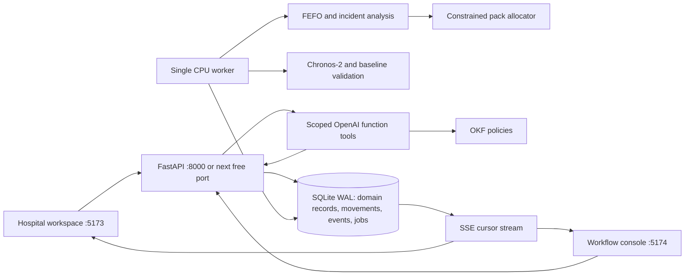

# Architecture and operational contracts

## Critical invariants

1. Only completed observations before the cutoff enter the forecasting input.
2. A raw forecast, planning adjustment, stress path and realised simulated outcome are separate concepts.
3. The allocation cap protects both donor coverage and competing recipients. A persuasive explanation cannot increase it.
4. A proposal's displayed benefit is evaluated independently of unapproved proposals.
5. Both hospitals approve the same version. Changing quantity resets approval.
6. Reservations reduce availability but not physical on-hand stock. Pickup moves inventory to transit; receipt moves it to recipient on-hand.
7. Model execution happens outside write transactions. A revision or generation mismatch supersedes the result.
8. Every quantity change has an immutable movement record; cancellation releases a reservation rather than manufacturing stock.
9. Clinical diagnosis is not inferred from consumption; zones represent operational planning policy.
10. Missing API/model/tile dependencies remain visible and never produce a false “live AI” success.

## Concurrency

All mutating domain operations use SQLite `BEGIN IMMEDIATE` with a 30-second busy timeout. Validations and writes occur in one transaction. The repository persists only changed records. The worker is single-process by design; do not start multiple workers against the prototype database.

Repeated analysis requests for the same generation and revision coalesce. Jobs heartbeat at model milestones and can be reclaimed after a 30-minute expired lease. Running jobs cannot overwrite a reset scenario or newer inventory/report state. Model caches are keyed by historical input, model revision, forecast configuration and policy version; report effects are recomputed outside the raw-model cache.

## Trade-offs

- The allocator is a deterministic feasible heuristic, not a global optimisation claim.
- Donor protection and recipient consumption use forecast assumptions, not guaranteed future patient outcomes.
- The three-hospital demo and six-facility evaluation network keep recalculation simple; an expanded deployment needs more efficient optimisation and a multi-tenant relational model.
- All agent actions are scoped by the server actor. Initial negotiation is deterministic; OpenAI tool calls optionally provide automatic proposal briefings and on-demand explanations or constrained counteroffers. Approvals remain explicit UI operations.
- The local role selector is intentionally permissive to demonstrate both sides. Production authentication and access provisioning are separate work.
- Outbreak intensity is a discrete facility-centred overlay, not an epidemiological spread model.
- Historical reconciliation and the live demonstration ledger have separate opening balances, documented in the generator and movement reasons.

## Runtime evidence

See `docs/evaluation-reference.json` for a measured synthetic test run. `make evaluate` regenerates current artifacts in `artifacts/`; the dashboard uses the newly generated artifact when available. Do not describe stored reference results as a fresh runtime benchmark.
